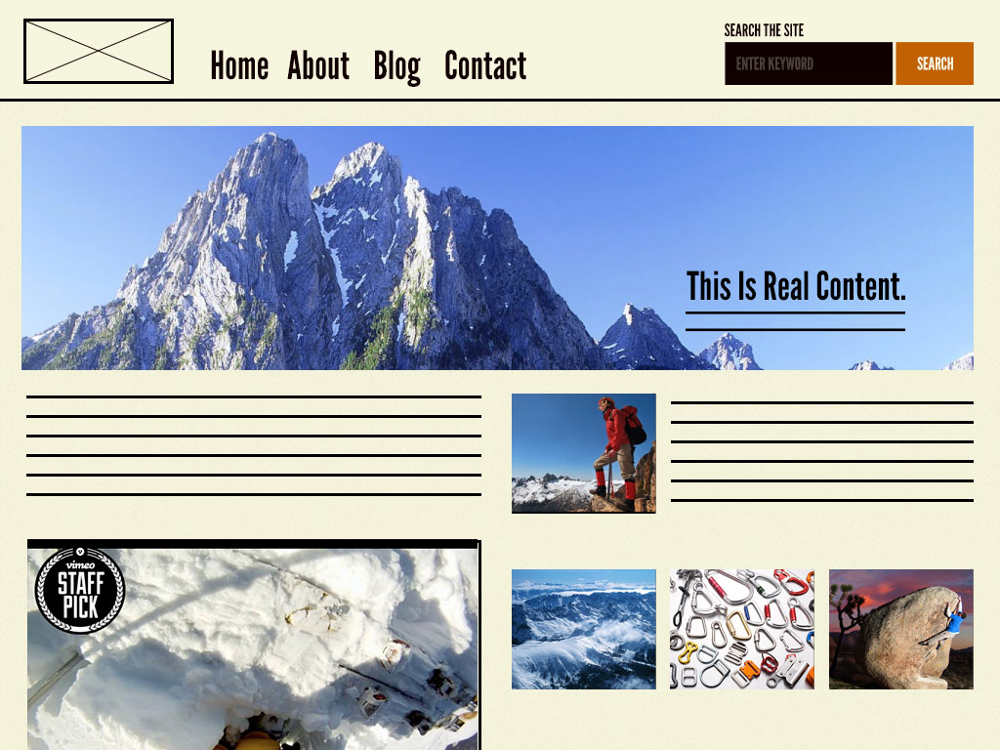

# Lesson 07 - Atomic Design

> We’re not designing pages, we’re designing systems of components. 
> —Stephen Hay

## Topics covered

* Atomic Design (Atoms, Molecules, Organism, Templates, Pages)
* Pattern Library ([Pattern Lab][2])

### Atomic Design

[Source][1]

**Atoms**
Atoms are the most abstract elements. These are the _raw materials_.
Example: colors, typefaces and HTML tags such as buttons, forms, images, text.

**Molecules**

Molecules are atoms combined to serve a specific purpose. These are the basic building blocks.

_Example: form-fields, labels, lists, sections._

**Organisms**

Organisms are molecules combined. These are reusable interface components. 

_Example: a header nav that includes a logo, links, a button, and a search bar._

**Templates**

Templates are formed by combining multiple organisms together. These are the wireframes that convey a structure.

_Example: a wireframe of a log-in screen, sign-up form, or checkout page._

**Pages**

_Pages are the final result. These are high-fidelity mockups of the templates._

### Pattern Library

A pattern library is a collection of user interface design patterns. It serves as a reference and a set of reusable code that scales and adheres to the design guidelines of the system.

## Resources
* [Brad Frost - Atomic Design][1]
* [Pattern Lab][2]
* [Design to Code with Atomic Design Principles][3]

[1]: http://bradfrost.com/blog/post/atomic-web-design/
[2]: http://demo.patternlab.io/
[3]: https://medium.com/re-write/the-unicorn-workflow-design-to-code-with-atomic-design-principles-and-sketch-8b0fe7d05a37