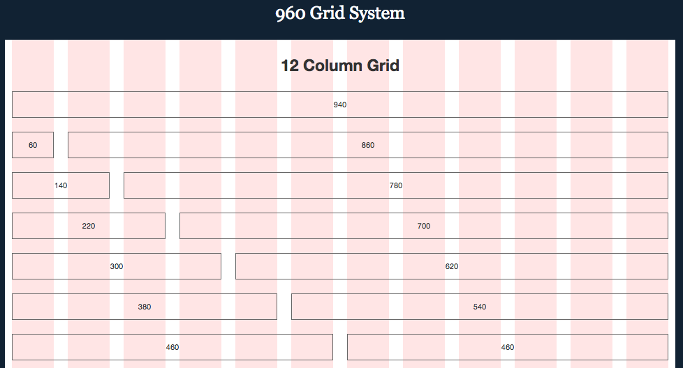
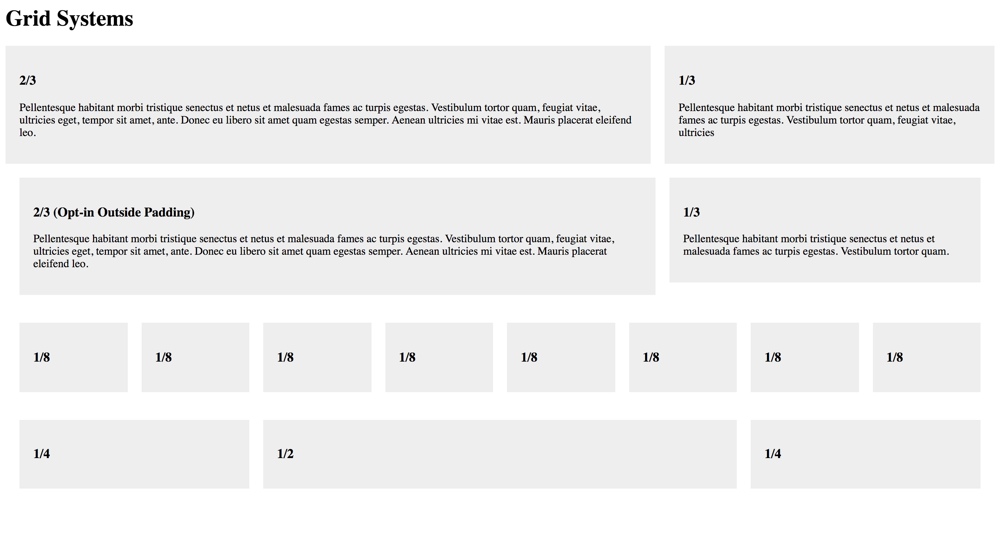

# Lesson 08 - Project Setup


## Topics covered

* File Folder Structure
* Grid Systems


## File Folder Structure

Having your project organized is key. Before you begin working on your project, setup your folder structure. This will allow you to keep a clear and organized mind throughout your project. 

- **_assets:** This folder contains fonts, icons, images, logos. These are to be shared with internal/external teams and it includes everything needed to build the app/site.

- **_exports:** This folder has all your design exports such as JPG, PNG, SVG files. Any time you export your designs, they go here.

- **build:** This folder contains your source code along with any other code examples, references or modules.

- **design:** This folder contains all design files from Sketch, PhotoShop or Illustrator. These should be organized by purpose (wireframes, journeys, branding, etc).

- **docs:** This folder contains all your design documentation (Word, Pages) and presentation files (Keynote, PowerPoint).


**Project folder structure:** ([Download Template](folder-template.zip))


```
ProjectName
.
├── _assets
│   ├── fonts
│   ├── icons
│   ├── images
│   └── logos
├── _exports
│   ├── jpg
│   ├── png
│   └── svg
├── build
│   └── src
├── design
│   ├── styleguide
│   ├── user-journeys
│   ├── user-personas
│   └── wireframes
└── docs
    ├── design-document
    └── presentation
```


## Grid Systems

The 960 Grid System dimensions are based on a width of **960 pixels**. The **12-column** grid is divided into portions that are **60 pixels** wide. Each column has 10 pixels of margin on the left and right, which create **20 pixel** wide gutters between columns. 



Source: [960 Grid System][5]


Read: [Don't Overthink It Grids - CSS Tricks][2]


### 1. Grid context

This is a block level that acts as the wrapper for our grid. 

**HTML**
```
<div class="grid">
  <!-- 100% wide -->
</div>
```

### 2. Columns

Let's start with a practical and common need: a main content area being 2/3 the width and a sidebar being 1/3 the width. We just make two column divs with appropriate class names.

**HTML**
```
<div class="grid">
  <div class="col-2-3">
     Main Content
  </div>
  <div class="col-1-3">
     Sidebar
  </div>
</div>
```

**CSS**
```
[class*='col-'] {
  float: left;
}

.col-2-3 {
  width: 66.66%;
}

.col-1-3 {
  width: 33.33%;
}

// Clearing context
.grid:after {
  content: "";
  display: table;
  clear: both;
}
```

### 3. Gutters

The first step toward this is using `box-sizing: border-box;`. The second step is applying a fixed padding to the right side of all columns except the last one.

Read: [Box Sizing][6]

```
*, *:after, *:before {
  -webkit-box-sizing: border-box;
  -moz-box-sizing: border-box;
  box-sizing: border-box;
}

[class*='col-'] {
  padding-right: 20px;
}
[class*='col-']:last-of-type {
  padding-right: 0;
}

```



[CSS Grid System - Demo](grid-system/index.html)

[CSS Grid System - Source Files](https://github.com/luiscielak/idd510_17sp/tree/master/lessons/08-project-setup/grid-system)

- - -

## Resources

* [A Step-by-Step Guide for Starting a New App Design Project in Sketch][1]
* [Don’t Overthink It Grids (CSS Tricks)][2]
* [Creating Your Own CSS Grid System][3]
* [A Complete Guide to Flexbox][4]
* [960 Grid System][5]
* [Box Sizing][6]

[1]: https://medium.com/ux-power-tools/a-step-by-step-guide-for-starting-a-new-app-design-project-in-sketch-469df0f24af8
[2]: https://css-tricks.com/dont-overthink-it-grids/
[3]: http://j4n.co/blog/Creating-your-own-css-grid-system
[4]: https://css-tricks.com/snippets/css/a-guide-to-flexbox/
[5]: http://960.gs/
[6]: https://css-tricks.com/almanac/properties/b/box-sizing/
